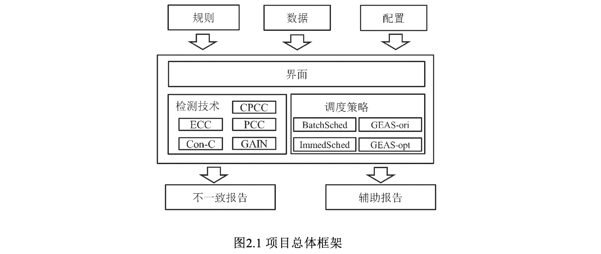
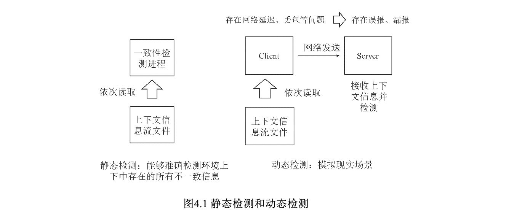

# CMID (<u>C</u>ontext <u>Mid</u>dleware)

 <p align="left">
  <a href="LICENSE" align="center">
    
  </a>
</p>

## 1. 项目简介

### 1.1. 项目背景

 上下文感知程序 (context-aware application) 已经在我们的生活中得到越来越广泛的应用，这类程序可以利用各种从环境中收集的信息，如 GPS 数据、环境温度、氧气浓度等来帮助程序提供更智能的服务，这部分程序感兴趣的环境信息也被称为程序的上下文(context)。上下信息通常是通过程序关联的各类传感器进行感知，但是由于传感器感知过程容易受到噪声等不可控因素的影响，最终感知到的上下文信息很有可能不准确、不完整甚至相互冲突，造成上下文不一致 (inconsistency) 问题，不一致的上下文信息会影响程序的正常功能，甚至会造成一些不可预期的严重后果。因此，如何对于上下文信息的一致性进一个预先的检测判断至关重要。

例如，一个上下文感知程序为监测城市 X 和 Y 的人员流动的程序 P，如图1.1所示，它所关心的环境上下文为城市 X 和 Y 的人员流动情况，有人员离开或进入某个城市会使得上下文信息发生改变，在时刻 3，程序 P 得到“Sanji enters city Y”的动作发生的信息后，程序 P 可能会发生错误，因为 Sanji 早 在 0 时刻已经进入了城市 X，并且在时刻 3 之前程序 P 并未得到“Sanji leaves city X”的动作信息，程序 P 会认为 Sanji 在时刻 3 既城市 X 又在城市 Y，即它认为 Sanji 在同一时刻出现在了不同的物理空间，这显然是不可能发生的，由此影响了程序 P 的正常功能。我们的项目适用于对这样的上下文不一致问题做出预先的检测和报告，为后续上下文信息的修复或直接丢弃提供指导作用。


### 1.2. 解决方案

由于直接判定上下文信息的一致性十分困难，所以我们项目的解决方式是通过根据上下文感知程序的应用场景预定义一系列不可违反的一致性规则(consistency constraint)，并根据这些规则来帮助检测上下文信息的一致性，一旦发现任何违反预定义规则的情况就认为此时的上下文信息存在不一致。

还是以图1.1为例，我们定义一致性规则为“同一个人不能同时出现在不同的地方”，因此，在时刻 3，“Sanji enters city Y”的动作发生后，由于一致性规则的存在，这个不一致问题会被系统报告，从而避免程序 P 发生不可预测的错误。

## 2. 项目框架

### 2.1. 总体架构

项目的总体软件架构如图2.1所示:




主要输入三项信息，这里仅简单说明：

- 规则：结合感知程序的应用场景人工自定义的一致性规则信息
- 数据：感知程序所关心的上下文信息数据流
- 配置：用于配置项目中集成的一致性检测技术和调度策略等信息

主要输出两项信息，这里仅简单说明：

- 不一致报告：报告数据中的违反规则的不一致信息
- 其他辅助报告：报告检测时间等额外信息

## 3. 环境依赖

### 3.1. 硬件依赖

- 主存：至少8GB
- 显卡 (可选)：项目运行 GAIN 技术需要一块支持 CUDA 编程的 NVIDIA 系列显卡，这是一种基于 GPU 的加速技术，若无需运行 GAIN 则可忽略本条

### 3.2. 软件依赖

- 操作系统：Linux 或 Windows，Linux 推荐使用 Ubuntu 16.04 LTS版本，Windows 推荐使用 Windows 10版本
- Java 运行环境：Oracle Java 8 或以上的版本
- 显卡驱动与 CUDA Tool Kit (可选)：根据本机显卡的型号到[驱动官网](https://www.nvidia.com/Download/index.aspx)和[NVIDIA开发者官网](https://developer.nvidia.com/zh-cn/cuda-downloads)下载安装

## 4. 如何运行

### 4.1. 运行准备

- 打开终端键入以下命令获取项目源代码：

  ```shell
  $ git clone https://gitee.com/growinware/CMID.git
  ```

- 创建一个配置文件[config.peoperties](config.properties)放在项目根目录下，各个配置项的含义如下：

  |      配置项       |                             含义                             | 是否必须（Y/N） |
  | :---------------: | :----------------------------------------------------------: | :-------------: |
  |   ruleFilePath    | 配置一致性规则文件，由一阶逻辑公式描述，可参考[rules.xml](consistency_rules.xml) |        Y        |
  |  patternFilePath  | 配置pattern文件，描述上下文集合，可参考[patterns.xml](consistency_patterns.xml) |        Y        |
  |   dataFilePath    |   配置上下文数据或变化文件，可参考[Road_C1.txt](data/Road_C1.txt)或[Road_C1_change.txt](data/Road_C1_change.txt)    |        Y        |
  |    logFilePath    |                       配置日志输出位置                       |        Y        |
  |     processor     |     配置检测技术，可选值为：xlinkit、GEAS_E、GEAS_C、GEAS_G和GEAS_I     |        Y        |
  | changeHandlerType | 配置运行方式（分别搭配上下文数据或变化文件），可选值为：static-time-based、 static-change-based、dynamic-time-based、dynamic-change-based |        Y        |
  |      taskNum      |        配置并发线程数，该配置项仅在GEAS_C下生效 | 	Y	 |
  |  oracleFilePath   | 配置oracle文件，若配置则会在检测结束后与oracle比较输出误报、漏报情况 |        N        |

- 通过[IntelliJ IDEA](https://www.jetbrains.com/idea/)选择项目根目录，导入项目
- 选择用静态检测方式或动态检测运行方式启动项目，如图4.1所示
  - 静态检测：系统不断地读取本地上下文信息数据流文件，并根据读到的数据依次检测上下文信息一致性
  - 动态检测：用 C/S 架构模拟现实中上下文信息的收集和 检测的过程，即由 Client 端按照数据文件中上下文信息的时间戳间隔将上下文信息通过网络发送给 Server，并由 Server 对从 Client 端接收到的上下文信息进行一致性约束检测



### 4.2. 静态运行

- 静态检测的主类是[Main](src/main/java/cn/edu/nju/Main.java)类，如图4.2所示，它以[config.peoperties](config.properties)文件路径作为参数

  

- 运行结束后会在预配置的logFilePath指定位置生成检测结果

### 4.3. 动态运行

- 运行动态检测：动态检测需要先如图4.3所示，以 config.properties 文件路 径作为参数，启动[Server](src/main/java/cn/edu/nju/server/Server.java)，待控制台提示成功启动 Server，再如图4.4所示，以 config.properties 文件路径作为参数，启动[Client](src/main/java/cn/edu/nju/client/Client.java)，若无错误信息输出则表示正常运行 (在同一项目里依次以 Server 和 Client 为主类启动即可)

  

  

- 运行结束后会在预配置的logFilePath指定位置生成检测结果

###4.4. Configuration

###  create a file named **config.properties**
```
#描述rule的xml文件路径
ruleFilePath=consistency_rules.xml
#描述pattern的xml文件路径
patternFilePath=consistency_patterns.xml
#描述context的txt文件路径
dataFilePath=data/Road_V1.txt
#指定输出log的路径
logFilePath=logs/log.txt
#kernel function
cudaSourceFilePath=src/main/kernel/kernel.cu
#算法选择（目前可选项是processor = xlinkit、GEAS_E、GEAS_C、GEAS_G和GEAS_I）
processor = xlinkit
#描述类型
changeHandlerType=static-time-based
#描述几个context change触发一次check（即batch值）
taskNum=-1
```
## 4.5. Run
### (1) Clone this repository.
```
$ git clone https://github.com/growinware-cn/CMID.git 
or 
$ git clone https://gitee.com/growinware/CMID.git
```
### (2) Import this project with **IntelliJ IDEA**.
### (3) Build this project.
### (4) Start to run.
```
$ java Main pathToConfigFile //config.properties
```
